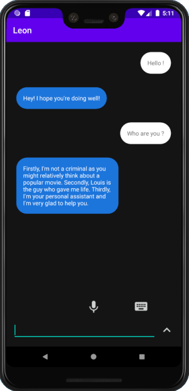

# /e/ Vocal Assistant

<p align="center">
  
</p>

## Introduction

/e/ Vocal Assistant is a project designed to be opensource and respectful application for the **/e/ OS**.
This project has to be incorporated within the [/e/ Foundation Project](https://gitlab.e.foundation/e)
This project was made using [Leon chatbot](https://github.com/leon-ai/leon)

## /e/  Project

The /e/ Foundation goal is to produce open source, privacy-enabled smartphone operating systems.

## Current Project State

The application features 3 majors parts :

 - A front-end Kotlin-based application that handles user's communication
 - Leon Chatbot as a back-end interpreter for speech to text or module's redirection
 - Leon's Modules, allowing adding features to the assistant such as SMS sending or Calendar handling

within the front-end we implemented a basic chat as well as a vocal handling.

The project features addition to Leon's chatbot in the handling of Front-end actions return, making the modules able to make android-based actions

## Development

### Installation

```bash
# clone the Vocal assistant repository
git clone https://github.com/PoCFrance/e poc-e
```

concerning the application, you will have to follow an [android studio guide](https://developer.android.com/guide) to lead you through the software

### Usage

```bash
# TODO
```

Rebuild the app if needed thanks to android studio software

## What's next

We plan to add multiples modules making the assistant bigger and able to handle more request.

Also, we did not yet implemented it on /e/ OS and it would be the next major step.