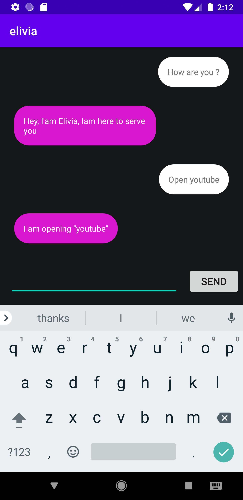

# Elivia Frontend

  

## Quick start

The only two folders you have to care about are the `core` and `src` ones.
The first contains a plugin manager, which will handle the Elivia response and dispatch to an appropriate plugin.
The second contains Kotlin class (the plugins).

You can learn more and have a look at an example by openning the default ones we provide.
They handle the open app and the send sms requests from the user.

## Plugins

It's really easy to add new plugins in the frontend.

You just need to do two things :

- Create a new kotlin class in the `app/java/com.poc.elivia/plugin/src` folder. This class will contain all necessary functions used by the plugin. You can take a look at the `OpenApp` and `SendSms` plugins already present in the app.

- Add a new statement in the `app/java/com.poc.elivia/plugin/core/PluginManager.kt` run function which will call a `[your_new_plugin_name]PluginManager` private function. It's role is to extract parameters used by the class previously created and then call the `[your_new_plugin_name].run` function.

Note that each one of the parameters extracted by the backend are located in `data["paramterName"]` where data is the json returned by the backend.
